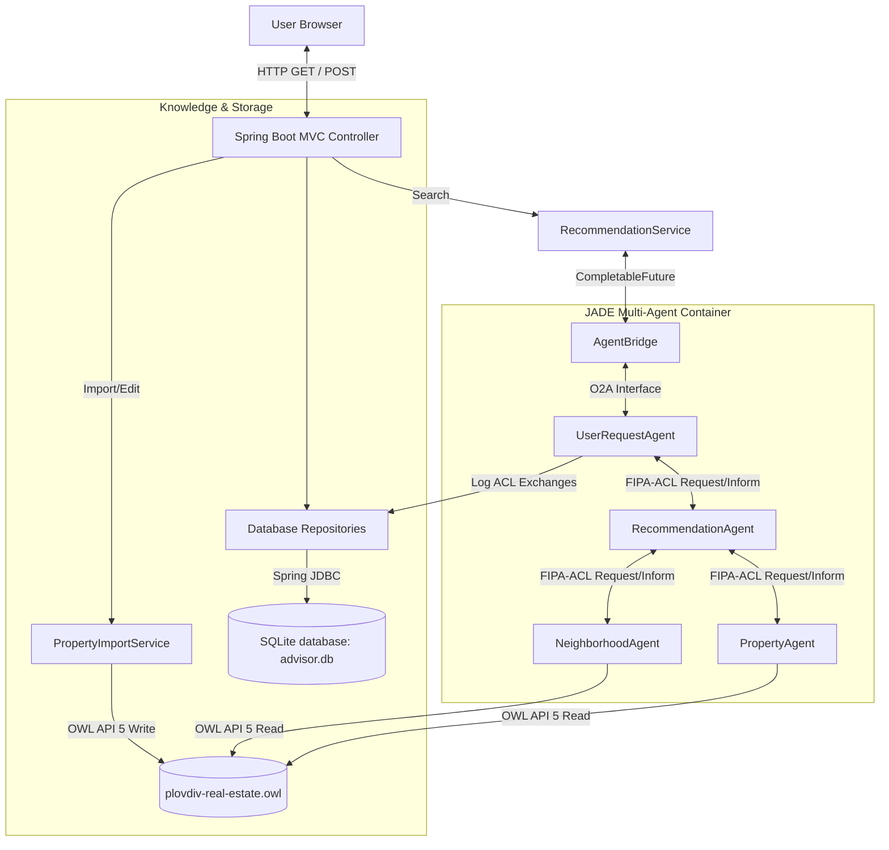

# Smart Real Estate Advisor for Plovdiv - System Documentation

This document serves as the comprehensive final report for the university project **Smart Real Estate Advisor for Plovdiv**. The application is designed to recommend residential properties in Plovdiv using a hybrid approach that integrates a semantic OWL ontology, a JADE-based multi-agent system communicating via FIPA-ACL JSON payloads, a relational SQLite database, and a Spring MVC dashboard.

---

## 1. Project Title, Goal, and Motivation

### Project Title
**Smart Real Estate Advisor for Plovdiv**

### Goal
The goal of this project is to build an intelligent, profile-driven real estate advisory web platform. Instead of forcing buyers to guess which districts, spec combinations, or amenity proximities fit their lifestyle needs (e.g. proximity to kindergarten for a family, proximity to hospitals for retired persons, proximity to universities for students), the platform dynamically calculates suitability scores out of 100 and ranks listings accordingly.

### Motivation
Standard real estate search portals only provide hard filter boundaries (e.g., price <= Max, rooms >= Min). This fails to incorporate:
- Soft lifestyle preferences (e.g. proximity to parks or public transit).
- Multi-agent collaboration where specialized agents query separate domains (listings specs vs. neighborhood facts).
- Semantic modeling using Web Ontology Language (OWL) to describe relations, construction types, and suitability rules.

---

## 2. Assignment Requirements Mapping

The project maps to all standard university assignment requirements for Semantic Web and Agent Systems:

| Requirement | Implementation in Project |
| :--- | :--- |
| **Semantic Modeling** | OWL 2 Ontology (`plovdiv-real-estate.owl`) containing class assertions, object properties, data properties, and individuals. |
| **Ontology Management** | Programmatic reading, querying, and updating of the ontology file using the Java **OWL API 5**. |
| **Agent Runtime** | Multi-agent execution using the **JADE** framework. |
| **Agent Communication** | Messages exchanged asynchronously using FIPA-ACL performatives (`REQUEST`, `INFORM`, `FAILURE`) with structured JSON content payloads. |
| **Spring Framework Integration** | A Spring-JADE bridge using a thread-safe asynchronous `AgentBridge` utilizing Java `CompletableFuture` to link the recommendation request-response cycle with JADE's message queue. Admin ontology writes use direct Spring service calls for a simpler and more reliable CRUD path. |
| **Persistence Layer** | Non-ontology database logs (ACL messages), favorite listings, and search histories persisted to SQLite using Spring's `JdbcTemplate` to keep SQL light and predictable. |
| **User Interface** | Modern Thymeleaf web interface incorporating responsive Bootstrap 5 forms, tables, card lists, and Leaflet interactive map markers. |

---

## 3. System Architecture Diagram

The system separates two flows: recommendation searches go through the JADE multi-agent platform, while admin import/edit operations call the ontology service directly.



---

## 4. Ontology Model: Classes, Properties, Individuals

The ontology is modeled in `plovdiv-real-estate.owl` and contains the structural vocabulary of Plovdiv's real estate domain.

### Classes
- `Property`: The base class representing real estate assets.
  - Subclasses: `Apartment`, `House`.
- `Neighborhood`: Represents Plovdiv districts.
- `ConstructionType`: Encompasses `BRICK`, `PANEL`, `MONOLITHIC`, `EPK`.
- `HeatingType`: Encompasses `CENTRAL_HEATING`, `AIR_CONDITIONER`, `GAS`, `ELECTRICITY`.
- `BuyerProfile`: Lifestyle profiles (`StudentProfile`, `FamilyProfile`, `RetiredProfile`, `InvestorProfile`, `YoungProfessionalProfile`).

### Object Properties
- `locatedInNeighborhood` (Property $\rightarrow$ Neighborhood)
- `hasConstructionType` (Property $\rightarrow$ ConstructionType)
- `hasHeatingType` (Property $\rightarrow$ HeatingType)
- `suitableForProfile` (Property $\rightarrow$ BuyerProfile): Recalculated dynamically after price or specification changes.

### Data Properties
- `hasPriceEUR` (xsd:decimal)
- `hasAreaSqM` (xsd:decimal)
- `hasPricePerSqM` (xsd:decimal)
- `hasRooms` (xsd:int)
- `hasBedrooms` (xsd:int)
- `hasFloor` (xsd:int)
- `hasTotalFloors` (xsd:int)
- `hasYearBuilt` (xsd:int)
- `isAvailable` (xsd:boolean)
- `hasElevator`, `hasParking`, `hasBalcony` (xsd:boolean)
- `hasLatitude`, `hasLongitude` (xsd:decimal)
- Distance properties: `hasDistanceToSchool`, `hasDistanceToKindergarten`, `hasDistanceToUniversity`, `hasDistanceToPark`, `hasDistanceToTransport`, `hasDistanceToHospital`, `hasDistanceToPharmacy` (xsd:int)

---

## 5. Agent Model: Agent Types, Responsibilities, ACL Communication

Four specialized JADE agents collaborate inside the recommendation workflow:

1. **`UserRequestAgent`**:
   - Actively listens for Spring-triggered tasks from the `AgentBridge` using the JADE Object-to-Agent (O2A) queue.
   - Translates them into FIPA-ACL messages and forwards them to specialized coordination agents.
   - Listens for responses and completes Spring's `CompletableFuture`.

2. **`RecommendationAgent`**:
   - Coordinates search requests.
   - Queries `PropertyAgent` for candidate property IDs and base specification matches.
   - Queries `NeighborhoodAgent` for lifestyle amenity scores.
   - Combines results, resolves tie-breaks, formats explanations, and replies to `UserRequestAgent`.

3. **`PropertyAgent`**:
   - Fetches matching listings from the ontology based on price, district, rooms, and construction constraints.
   - Computes base scores (budget fit, feature fit, district fit) out of 65 points.

4. **`NeighborhoodAgent`**:
   - Evaluates proximity data for the buyer's lifestyle profile.
   - Computes neighborhood scores (distance to universities, parks, schools, pharmacies) out of 35 points.

### ACL JSON Message Schema
Every JADE ACL message carries a JSON payload with a standard contract:
```json
{
  "requestId": "924bdf75-a568-463e-a41d-5835ef9df3a8",
  "type": "SEARCH_PROPERTIES",
  "payload": {
    "profile": "FAMILY",
    "maxBudgetEUR": 250000,
    "districts": ["TRAKIA"],
    "minRooms": 2,
    "minBedrooms": 1,
    "priorities": ["School", "Kindergarten"]
  },
  "errors": []
}
```

---

## 6. Database Design

SQLite is used to store non-semantic operational data such as user logs, favorites, history, and import metadata.

```text
+------------------+         +-------------------+
|      users       |         |  search_history   |
+------------------+         +-------------------+
| id (PK)          |<------- | id (PK)           |
| display_name     |         | user_id (FK)      |
| created_at       |         | criteria_json     |
+------------------+         | selected_profile  |
       ^   ^                 | created_at        |
       |   |                 +-------------------+
       |   +--------------------------+
       |                              |
+------------------+
|    favorites     |
+------------------+
| id (PK)          |
| user_id (FK)     |
| property_id (UN) |
| created_at       |
+------------------+
```

- **`agent_logs`**: Logs all JADE ACL traffic (`id`, `request_id`, `sender`, `receiver`, `performative`, `message_summary`, `created_at`).
- **`import_batches`**: Metadata tracking CSV uploads (`id`, `file_name`, `total_rows`, `imported_rows`, `failed_rows`, `status`, `created_at`).

---

## 7. User Interface and Workflows

The web UI is responsive and styled using custom Bootstrap 5 grids, cards, and interactive map popups.

### Workflows:
1. **Interactive Search**: Users fill criteria in the home form $\rightarrow$ Spring forwards queries to JADE $\rightarrow$ JADE returns suitability-ranked listings $\rightarrow$ Leaflet displays matching marker popups $\rightarrow$ Users inspect details or comparison tables.
2. **Side-by-Side Comparison**: Users check checkboxes on 2-4 search result cards and click "Compare Selected" $\rightarrow$ A comprehensive specification sheet is rendered side-by-side.
3. **Favorites Dash**: Users toggle favorites (persisted in SQLite) and inspect saved listings.
4. **Admin Console**: Administrators import bulk listing files, edit attributes (saving changes to OWL), mark properties unavailable, or view JADE multi-agent logs.

---

## 8. Ontology Manipulation Process

When an admin uploads a CSV or edits properties:
1. The controller calls `PropertyImportService`.
2. `PropertyImportService` validates/parses input and calls `OntologyService` directly.
3. `OntologyService.upsertProperty()` generates or updates an OWL individual (`Property_[ID]`).
4. Data properties (e.g. price, area) are asserted.
5. The system recalculates its profile suitability rules dynamically using application-level Java calculations and asserts the object property `suitableForProfile` (e.g., `Property_001 suitableForProfile FamilyProfile`).
6. `OntologyService.save()` serializes the updated ontology back to `plovdiv-real-estate.owl`.

---

## 9. Recommendation Logic and Examples

The suitability scoring is deterministic and calculated out of 100 points:

$$\text{Final Score (100 pts max)} = \text{Budget Fit (25 pts)} + \text{Property Features (25 pts)} + \text{District Preference (15 pts)} + \text{Neighborhood Amenity Fit (35 pts)}$$

- **Budget Fit (25 pts)**:
  - Price is $\ge 15\%$ below max budget: 25 pts.
  - Price is within budget but $< 15\%$ below: 18 pts.
- **Neighborhood Amenity Proximity (35 pts)**:
  - **Family**: Proximity to school $\le 800m$ (10 pts), kindergarten $\le 800m$ (10 pts), park $\le 1000m$ (7 pts), elevator (4 pts), parking (4 pts).
  - **Student**: Proximity to university $\le 1500m$ (14 pts), transport $\le 500m$ (10 pts), low price/sq.m (6 pts), student-focused district (5 pts).
  - **Retired Person**: Elevator or floor $\le 2$ (10 pts), pharmacy $\le 700m$ (8 pts), hospital $\le 2000m$ (7 pts), park $\le 1000m$ (5 pts), transport $\le 500m$ (5 pts).

---

## 10. Testing, Limitations, and Future Improvements

### Testing
We maintain comprehensive unit and integration suites (23 tests passing):
- `OntologyServiceTests`: Verifies OWL loading, property upserts, price updates, and suitability recalculations.
- `AgentAclIntegrationTests`: Verifies thread-safe O2A searches, PropertyAgent timeouts, NeighborhoodAgent fallbacks, and agent log sqlite saves.
- `CompareAndFavoritesTests`: Verifies SQLite favorites persistence and dynamic comparison table calculations.

### Limitations
- Multi-user authentication is omitted (uses default `Demo User` with ID 1).
- Proximity calculations are pre-calculated inside the synthetic CSV instead of calling dynamic spatial APIs like OpenStreetMap.

### Future Improvements
- Integrate active OWL reasoner inference (e.g. Pellet or HermiT) for class assertions.
- Leverage real Plovdiv public transport GIS shapefiles to compute transit proximities.
